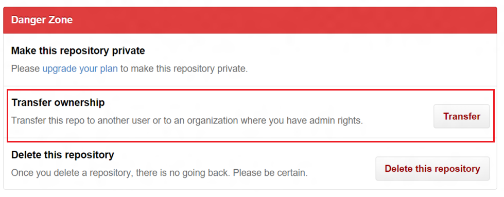

# Contribute to DscResources repository

Hi there! We're thrilled that you'd like to contribute to this project. Your help is essential to keeping it great. 

## Use GitHub, Git, and this repository

Start by reading our [guide to getting started with GitHub](GettingStartedWithGitHub.md).

### Clone repository from GitHub

Open GitHub repository of a module. 
To find, it you can go to all [`xDscResources`](xDscResources) or search in [PowerShell GitHub org repos](https://github.com/PowerShell).

I.e. if you want to contribute to **xActiveDirectory** you can do the following

* Find module


* Click on hyperlink to go to corresponding GitHub repo


* Copy **url** from the browser or copy it from the GitHub UI on the right


* In PowerShell, run command:

```
git clone <url>
```

i.e.

```
git clone https://github.com/PowerShell/xActiveDirectory
```

* Git will create a new directory with corresponding name (i.e. `xActiveDirectory`).

### Forking a repository on GitHub

To send changes from you local machine, you would first need to upload them to your **fork** of our repo.
Use fork button on the right side of repo GitHub page.


### Adding the fork as a remote on the local machine

You would need to add your fork as a [remote](http://git-scm.com/book/en/v2/Git-Basics-Working-with-Remotes) to send changes there.
* Get fork url (same way as original repo url, open fork GitHub page in browser and copy from it).
* Run `git remote add my <url>`, i.e. `git remote add my https://github.com/vors/xActiveDirectory`.
* Check correctness with `git remote -v`

```
> git remote -v
my	https://github.com/vors/xActiveDirectory (fetch)
my	https://github.com/vors/xActiveDirectory (push)
origin	https://github.com/PowerShell/xActiveDirectory (fetch)
origin	https://github.com/PowerShell/xActiveDirectory (push)
```

* Now you have two remote references: **origin** to the original repository and **my** to your fork.

### Making changes and pushing them to the fork

* To make changes, create a new local branch: `git checkout -b <branch>`, i.e. `git checkout -b awesome_feature`.
* To see all branches, run `git branch -a`

```
> git branch -a
* master
  remotes/origin/HEAD -> origin/master
  remotes/origin/master
```
Active branch is marked with `*`.
`-a` flag tells git to show both [**local**](http://git-scm.com/book/en/v2/Git-Branching-Basic-Branching-and-Merging) and [**remote**](http://git-scm.com/book/en/v2/Git-Branching-Remote-Branches) branches.

* make you changes and **commit** them with `git commit -a -m "<Commit message>"`.
`-a` flag tells git to include all modified files in commit.
`-m` flag specifies the commit message.

* To get the big picture of current state of your repository, use `gitk --all` command. It opens a UI with a lot of usefull information. You can read more about **gitk** [here](https://lostechies.com/joshuaflanagan/2010/09/03/use-gitk-to-understand-git/).


* After that can **push** changes to your fork with `git push my <branch>` command, i.e. `git push my awesome_feature`.
 
## Contributing to existing DSC resources

GitHub provides contribution model with [Pull Requests](https://help.github.com/articles/using-pull-requests/).
Once you [fork](https://help.github.com/articles/fork-a-repo/) a repository you have a full control on your fork.
To contribute changes you made back to our repository, you create a pull request.
Pull request lifecycle:

* when you create a pull request, describe what's the purpose of it in description. 
Always create Pull Request to `dev` branch, see [branches structure](#branches-structure) for details.
If it's relate to existing github issue, it's a good idea to put an issue reference in the description.

* If it's your first contribution to DscResources, you would be asked to sign-up contributors agreement.

* CI system [runs a build with tests](#appveyor) and updates pull request status.

* One of module maintainers (it can be somebody from PowerShell team or a community member) will do a code review.

* Once code review done, merge conflicts resolved and CI build is green, maintainer will merge your changes.

### Contributing to documentation
One of the easiest ways to contribute to a PowerShell project is by helping to write and edit documentation. 
All of our documentation hosted on GitHub is written using [GitHub Flavored Markdown](https://help.github.com/articles/github-flavored-markdown/) in the style of [this example](DscResourcesExampleHelp.md).
Please make sure to also follow our [style guidelines](#style-guidelines) when writing documentation. 

To [edit an existing file](https://help.github.com/articles/editing-files-in-another-user-s-repository/), simply navigate to it and click the "Edit" button. 
GitHub will automatically create your own fork of our repository where you can make your changes. 
Once you're finished, save your edits and submit a pull request to get your changes merged upstream. 

If you want to contribute new documentation, first check for [issues tagged as "Documentation"](https://github.com/PowerShell/DscResources/labels/documentation) to make sure you're not duplicating efforts.
If no one seems to be working on what you have planned:
* Open a new issue tagged as "Documentation" to tell others what you're working on
* Create a fork of our repository and start adding new Markdown-based documentation to it
* When you're ready to contribute your documentation, submit a pull request to the *dev* branch

### Improving test coverage for existing resources

All DSC modules in the DscResources should have tests written using [Pester](https://github.com/pester/Pester) included in a Tests folder. 

One of the most effective ways to report a bug is to provide a Pester test that fails. 
It dramatically simplifies work for the person who will fix it, increases code coverage, and prevents regressions in the future.

### Creating a new resource in an existing module

If you would like to add a DSC resource:
* Open an issue in the module repository where you'd like to add a DSC resource to coordinate your work with others.
* Fork the *dev* branch of the module repository you'd like to improve:
    - `git checkout dev`
    - `git checkout -b my_awesome_new_resource`
* In your own forked branch, add and develop your new resources. Make sure you:
    - Write pester tests.
    - Write documentation using GitHub Flavored Markdown 
    - Write (or alter) an example configuration in the Examples subdirectory demonstrating how your resource should be used
    - DO NOT change the *.psd1 ModuleVersion (we will be updating this before releasing to the Gallery)


## Contributing a new DSC resource module

If you would like to share your DSC resource module or create a brand new module, first [open an issue](https://github.com/PowerShell/DscResources/issues) with following information:

* What system will your DSC resources be managing?
    - For example, [xActiveDirectory](https://github.com/powershell/xActiveDirectory) models and manages Active Directory
* Will your module include [MOF-based resources](TODO) (compatible with PS/WMF 4.0 and 5.0+) or [class-based resources](TODO) (only compatible with PS/WMF 5.0+)

Next, develop your DSC resources in your own module repository. Make sure you:

* Write a set of test cases specific to your resources using Pester. Place them in a `Tests` directory.
* Use the template from the [DscResource.Template folder](DscResource.Template) as a boilerplate [appveyor.yml](appveyor.yml) for continuous integration (CI).
* Run all common tests located in [DSCResource.Tests](https://github.com/PowerShell/DscResource.Tests)

Follow up in the issue you opened to discuss repo ownership with the PowerShell team.
There are two options:
* Transfer full ownership of your module to the PowerShell organization.
This means we will have full control and permissions to the module repository.
In the future, you will have to fork and submit pull requests to commit changes as if it were any other submodule in [DscResources](https://github.com/PowerShell/DscResources).

* Allow the PowerShell organization to fork your repository and use that fork as a submodule of [DscResources](https://github.com/DscResources).
This means that you can continue to operate as you wish on your own branch of the module.
However, you should still submit pull requests to our fork in order to take your changes into the "official" version of the module. 

## AppVeyor

We use [AppVeyor](http://www.appveyor.com/) as a continious integration (CI) system.
AppVeyor builds and runs tests on every pull request and provides quick feedback about it.


## Common Tests
We have provided a set of common tests for DSC resources in [DSCResource.Tests](https://github.com/PowerShell/DscResource.Tests)
They primarly concentrate on things like code style, encoding, and module version consistency.
The `appveyor.yml` file in each module repository describes the build and test sequence for CI. 
Make sure to run these tests before submitting a pull request. 

## Style guidelines

When contributing to any PowerShell repositories, please follow the following guidelines: 

* For all indentation, use 4 spaces instead of tab stops
* Make sure all files are encoding using UTF-8. 
* Windows handles [newlines](http://en.wikipedia.org/wiki/Newline) using CR+LF instead of just CR. 
For interoperability reasons, we recommend that you follow [these instructions](GettingStartedWithGitHub.md#setup-git) when installing Git on Windows so that newlines saved to GitHub are simply CRs. 
* When writing Markdown, if a paragraph includes more than one setence, end each sentence with a newline.
GitHub will still render the sentences as a single paragraph, but the readability of `git diff` will be greatly improved. 


## Branches structure

We are using a [git flow](http://nvie.com/posts/a-successful-git-branching-model/) model for development.
We recommend that you create local working branches that target a specific scope of change. 
Each branch should be limited to a single feature/bugfix both to streamline workflows and reduce the possibility of merge conflicts.

