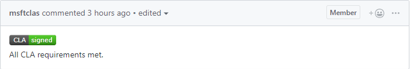

# Contributing to the DSC Resource Kit

Welcome to the DSC Resource Kit! We're thrilled that you'd like to contribute! Our community is essential to creating and maintaining all the DSC Resources. 

There are a few different ways you can contribute:

* [Submit an issue](#submitting-an-issue)
* [Fix an issue](#fixing-an-issue)
* [Write documentation](#writing-documentation)
* [Review pull requests](#reviewing-pull-requests) 

If you're just starting out with GitHub, start by reading our [guide to getting started with GitHub](GettingStartedWithGitHub.md).

If you have any questions or concerns, feel free to reach out to [@kwirkykat](https://github.com/kwirkykat) or [@mbreakey3](https://github.com/mbreakey3) for help.

This project has adopted the [Microsoft Open Source Code of Conduct](https://opensource.microsoft.com/codeofconduct/).
For more information see the [Code of Conduct FAQ](https://opensource.microsoft.com/codeofconduct/faq/) or contact [opencode@microsoft.com](mailto:opencode@microsoft.com) with any additional questions or comments.

## Submitting an Issue
Submitting an issue to the DSC Resource Kit is easy!

Here are the steps:

1. Find the correct repository to submit your issue to.
2. Make sure the issue is not open already.
3. Open a new issue.
4. Fill in the issue title.
5. Fill in the issue description.
6. Submit the issue.

### Find the Correct Repository
| Issue Topic | Where to Submit |
|-------------|-----------------|
| <ul><li> DSC Resource Kit overall </li><li> Issues that span multiple resource modules </li><li> DSC Resource Kit processes </li></ul> | DscResources (this repository!) |
| <ul><li> Common tests </li><li> Meta-fixers </li></ul> | [DscResource.Tests](https://github.com/PowerShell/DscResource.Tests)
| <ul><li> Bugs, feature requests, enhancements to a specific resource </li><li> Resource proposals </li></ul> | The repository of the resource module that contains/should contain the resource. |
| <ul><li> Bugs, feature requests, enhancements that span multiple resources within one resource module </li></ul> | The repository of that resource module |

You can access a resource module repository with the following URL:
```
https://github.com/PowerShell/<name of resource module>
```
For example, to get to the xCertificate module repository, the URL is:  
```
https://github.com/PowerShell/xCertificate
```

All DSC resource modules are also listed as submodules of this repository under the [xDscResources](xDscResources) and [DscResources](dscresources) folders.

### Open an Issue
Once you are in the correct repository to submit your issue, go to the Issues tab.


**Ensure that the issue you are about to file is not already open.**
If someone has already opened a similar issue, please leave a comment or add a GitHub reaction to the top comment to **express your interest**. You can also offer help and use the issue to coordinate your efforts in fixing the issue.

If you cannot find an issue that matches the one you are about to file, click the New Issue button on the right.


A new, blank issue should open up.


### Fill in Issue Title
The issue title should be a brief summary of your issue in one sentence.
If it pertains to only one specific resource please prefix the issue title with the resource name followed by a colon.
For example:


If you would like to submit an issue that would include a breaking change, please also refer to our [Breaking Changes](#breaking-changes) section below.
 
### Fill in Issue Description
The issue description should contain a **detailed** report of the issue you are submitting.
If you are submitting a bug, please include any error messages or stack traces caused by the problem.

Please reference any related issues or pull requests by a pound sign followed by the issue or pull request number (e.g. #11, #72). GitHub will automatically link the number to the corresponding issue or pull request. You can also link to pull requests and issues in other repositories by including the repository owner and name before the issue number.
Like this:
```
<owner name>/<repository name>#<number of PR/issue>
```
So to link to issue #160 in the xPSDesiredStateConfiguration repository which is owned by PowerShell:
```
PowerShell/xPSDesiredStateConfiguration#160
```

Please also tag any GitHub users you would like to notice this issue. You can tag someone on GitHub with the @ symbol followed by their username.(e.g. @kwirkykat)

### Submit an Issue
Once you have filled out the issue title and description, click the submit button at the bottom of the issue.


## Fixing an Issue
Here's the general process of fixing an issue in the DSC Resource Kit:  
1. Pick out the issue you'd like to work on.  
2. Create a fork of the repository that contains the issue.  
3. Clone your fork to your machine.  
4. Create a working branch where you can store your updates to the code.  
5. Make changes in your working branch to solve the issue.  
6. Write tests to ensure that the issue is fixed.  
7. Update the 'Unreleased' section of the module's release notes to include your changes.   
8. Submit a pull request to the dev branch of the official repository for review.  
9. Make sure all tests are passing in AppVeyor for your pull request.  
10. Make sure your code does not contain merge conflicts.  
11. Address any comments brought up by the reviewer. 

### Pick an Issue
Issues that are currently up-for-grabs are tagged with the ```help wanted``` label.
You can see all the issues tagged with ```help wanted``` across all the modules in the DSC Resource Kit in the Help Wanted column on our [dashboard](https://waffle.io/powershell/dscresources/join).

If you find an issue that you want to work on, but it does not have the ```help wanted``` label, make sure to read through the issue and ask if you can start working on it.

### Fork a Respository
A 'fork' on GitHub is your own personal copy of a repository.
GitHub's guide to forking a repository is available [here](https://help.github.com/articles/fork-a-repo/).
You will need a fork to contribute to any of the repositories in the DSC Resource Kit since only the maintainers have the ability to push to the official repositories.

Once you have created your fork, you can easily access it via the URL:
```
https://github.com/<your GitHub username>/<module name>
```

### Clone your Fork
You will want to clone your fork so that you can edit code locally on your machine.
GitHub's guide to cloning is available [here](https://help.github.com/articles/cloning-a-repository/).

### Create a Working Branch
We use a [git flow](http://nvie.com/posts/a-successful-git-branching-model/) model in our official repositories.

Your fork is your personal territory.
You may set it up however best suits your workflow, but we recommend that you set up a working branch separate from the default dev branch. 
Creating a working branch separate from the default dev branch will allow you to create other working branches off of dev later while your original working branch is still open for code reviews.
Limiting your current working branch to a single issue will also both streamline the code review and reduce the possibility of merge conflicts.

The Git guide to branching is available [here](https://git-scm.com/book/en/v2/Git-Branching-Basic-Branching-and-Merging).

### Make Code Changes
When writing code for any of the modules in the DSC Resource Kit, please follow the DSC Resource Kit [Style Guidelines](StyleGuidelines.md) and [Best Practices](BestPractices.md).
These guidelines are specific to the DSC Resource Kit and may not always reflect the same PowerShell style as other projects.
Code reviewers will expect you to follow these guidelines and may ask you to change your code for consistency.

If you need help committing and pushing your code to your fork, please refer to our [guide to getting started with GitHub](GettingStartedWithGitHub.md).

Pay attention to any new code merged into the dev branch of the official repository. If this occurs, you will need to pick-up these changes in your fork using the rebase instructions in our [guide to getting started with GitHub](GettingStartedWithGitHub.md).

If you are making a breaking change, please make sure to read the [Breaking Changes section](#breaking-changes) below.

### Write Tests
All DSC modules in the DscResources should have tests written using [Pester](https://github.com/pester/Pester) included in the Tests folder.
You are required to provide adequate test coverage for the code you change.

The tests in the following modules provide excellent examples:  
* [xNetworking](https://github.com/PowerShell/xNetworking/tree/dev/Tests)  
* [xDhcpServer](https://github.com/PowerShell/xDhcpServer/tree/master/Tests)  
* [SharePointDsc](https://github.com/PowerShell/SharePointDsc/tree/master/Tests)  

We highly encourage you to use our [test templates](https://github.com/PowerShell/DscResources/tree/master/Tests.Template) when creating tests for DSC resources.
Please refer to our [testing guidelines](https://github.com/PowerShell/DscResources/blob/master/TestsGuidelines.md) for information on how to use these templates.  
Our test templates and guidelines are currently under construction.
Use them with caution as they may be changed soon.

Tests should currently be structured like so:

* Root folder of module  
    * Tests  
        * Unit  
            * MyResource.Tests.ps1  
        * Integration  
            * MyResource.Integration.Tests.ps1  

Not all resources currently have tests.
This does not mean that you do not have to write tests for your changes.
If you find that the test file for a resource is missing or one of the folders in the structure outlined above is missing, please create it.
You don't have to write the full set of tests for the resource if you are creating the file.
You only need to test the changes that you made to the resource.

### Update the Release Notes
Release notes for each module are included in the README.md file under the root folder.
Currently unreleased changes are listed under the 'Unreleased' section under the 'Versions' header.
If this section is missing, please add it.

To update the release notes with your changes, simply add a bullet point (or more) with your changes in the **past** tense under the 'Unreleased' section.  
For example:  
```
...
## Versions

### Unreleased
- Added the FriendlyName parameter to Update-xDscResource

### 1.4.0.0
...
```
If a change is related to a specific resource, please add sub-bullets with your changes under a bullet with the resource name.  
Like so:
```
...
## Versions

### Unreleased
- Added the optional FriendlyName parameter to Update-SampleResourceMode
- xSampleResource
    - Included support for capitalized names
    - Fixed error message when negative number is given for durationInMinutes
- xSampleResource2
    - Fixed a typo in verbose message 
    
### 1.4.0.0
...
```

If you are making a breaking change, please make sure to read the [Breaking Changes section](#breaking-changes) below.

### Submit a Pull Request
A [pull request](https://help.github.com/articles/using-pull-requests/) (PR) allows you to submit the changes you made in your fork to the official repository.

To open a pull request, go to the Pull Requests tab of either your fork or the official repository.


Click the New Pull Request button on the right:


The base is the repository and branch the pull request will be merging **into**.
The target is the repository and branch the pull request will be merging **from**.
For the DSC Resource Kit, always create a pull request with the base as the **dev** branch of the official repository.  
(Except for *this* repository - DscResources - which does not have a dev branch because it does not get released to the PowerShellGallery. For this repository you may create a pull request to the master branch.) 
The target should be your working branch in your fork.


Once you select the correct base and target, you can review the file and commits that will be included in the pull request by selecting the tabs below the Create Pull Requests Button:


If GitHub tells you that your branches cannot automatically be merged, you probably have merge conflicts. These should be fixed before you submit your pull request.


For help fixing merge conflicts see our [guide to getting started with GitHub](GettingStartedWithGitHub.md).

Once you are ready to submit your pull request, click the Create Pull Request button.


#### Pull Request Title
The title of your PR should *describe* the changes it includes in one line. 
Simply putting the issue number that the PR fixes is not acceptable.
If your PR deals with *one* specific resource, please prefix the title with the resource name followed by a colon.
If your PR fixes an issue please do still include "(Fixes #issue number)" in the title.
For example, if a PR fixes issues number 11 and 16 which adds the Ensure parameter to the xSample resource, the title should be something like:  
"xSample: Added Ensure parameter (Fixes #11, #16)".

If your pull request includes a breaking change, please refer to the [Breaking Changes](#breaking-changes) section below.

If you open a pull request with the wrong title, you can easily edit it by clicking the Edit button to the right of the title in the open pull request.

#### Pull Request Description
The description of your PR should include a detailed report of all the changes you made.
If your PR fixes an issue please include the number in the description.
Please tag anyone you would specifically like to see this PR with the @ symbol followed by their GitHub username (e.g. @kwirkykat).

Once you are satisfied with the title, description and file changes included, submit the pull request.

#### Contribution License Agreement (CLA)
If this is your first contribution to the DSC Resource Kit, you may be asked to sign a [Contribution Licensing Agreement](https://cla.microsoft.com/) (CLA) before your changes can be reviewed:


Once you sign the CLA, the Microsoft CLA bot will automatically update your PR:


Once you have signed our CLA, you shouldn't have to do it again. 
If you believe you have signed our CLA before, but the Microsoft CLA bot still marks your PR as cla-required, please sign the CLA again.
Sometimes the little bot makes mistakes.

### Tests in AppVeyor
The DSC Resource Kit uses [AppVeyor](http://www.appveyor.com/) as a continuous integration (CI) system.

After submitting your pull request, AppVeyor will automatically run a suite of tests on your submitted changes.
Afterwards, AppVeyor will update the status of the pull request, providing at-a-glance feedback about whether your changes are passing tests or not.  


All the green checkboxes and red crosses are **clickable**. 
They will bring you to the corresponding test page with details on which tests are running and why your tests may be failing. 

A maintainer **will not** merge your pull request if these tests are failing, even if they have nothing to do with your changes.
If test failures are occurring that do not relate to the changes you made, you will have to submit another PR with fixes for those failures or wait until someone else does.

Any commit to the working branch that is the target of the pull request will trigger the tests to run again in AppVeyor.
If you tag a maintainer, they can also re-run your tests in AppVeyor. 

The appveyor.yml file in each module repository describes the build and test sequence provided to AppVeyor.

An AppVeyor badge indicating the latest build status of the **master** branch is at the top of the README.md file of every DSC Resource repository.  


This badge is also **clickable**.
It opens the corresponding module's AppVeyor page which shows test logs and results.
From this page you can easily navigate through the build history of the module.

#### Common Tests
There is a set of common tests for all DSC Resources located in the [DSCResource.Tests](https://github.com/PowerShell/DscResource.Tests) repository. 
These tests primarily concentrate on code style, file encoding, correct module schema, and PS Script Analyzer issues.

You should run these tests before submitting a pull request. 

For some modules, the common DSC Resources tests are automatically downloaded into the root module folder when tests are invoked.

If this is not happening for your module, you will need to clone [DSCResource.Tests](https://github.com/PowerShell/DscResource.Tests) into the root folder of the module that you want to test.
Then simply run `Invoke-Pester` from the root folder.

Like this:  
```
cd C:\MyPath\ResourceModuleFolder
git clone https://github.com/PowerShell/DscResource.Tests
Invoke-Pester
```

Please avoid adding the **DSCResource.Tests** folder to your changes.
DSCResource.Tests should be in the .gitignore file so that git will automatically ignore this folder.
If DSCResource.Tests is not in the .gitignore file, please add it.
If there is no .gitignore file for your module, instructions on how to add one are available in our [getting started with GitHub](GettingStartedWithGitHub.md) instructions.

The [MetaFixers](https://github.com/PowerShell/DscResource.Tests/blob/master/MetaFixers.psm1) module also in [DSCResource.Tests](https://github.com/PowerShell/DscResource.Tests) contains a few fix-helper methods such as a function to convert all tab indentations to 4 spaces and a function to fix file encodings.

### Fix Merge Conflicts
If you have merge conflicts, please use Git rebasing to fix them instead of Git merging.
An introduction to Git rebasing is available in the [getting started with GitHub](GettingStartedWithGitHub.md) instructions.

### Get your Code Reviewed
Anyone other than you can *review* your code, but only maintainers can *merge* your code.
If you have a specific contributor/maintainer you want to review your code, be sure to tag them in your pull request.

We don't currently have dedicated maintainers for most modules, so it may take a while for a general maintainer to get around to your pull request.
Please be patient.

## Breaking Changes
Breaking changes should first be proposed by opening an issue on the resource and outlining the needed work.
This allows the community to discuss the change before the work is done and scopes the breaks to needed areas.

Opening an issue also allows the resource owner or the DSC Resource Kit Owner ([@kwirkykat](https://github.com/kwirkykat)) to tag the issue with the ```breaking change``` label.

Breaking changes may include:

- Adding a new mandatory parameter
- Changing an existing parameter
- Removing an existing parameter
- Fundamentally changing an existing functionality of a resource

Once a PR is ready with the breaking change please include the following:

1. At least one of the bullet points in your addition to the updated release notes starts with 'BREAKING CHANGE:'    
2. The title of the PR that includes your breaking change starts with 'BREAKING CHANGE:'

## Submitting a New Resource
If you would like to add a new DSC resource, please open an issue in the repository you think the new resource should be in.
This will help to coordinate your work with other contributors.

Once the issue is open, you may begin working on your resource just as if you were fixing the issue you submitted.
See the [Fixing an Issue](#fixing-an-issue) section above for further details.

Be sure to include unit and integration tests for your new resource under the Tests folder as well as an example under the examples folder.
Please also add a full description of your new resource and its parameters to the module's README.

### Resource Naming

All mof-based resource (with Get/Set/Test-TargetResource and a schema.mof file) files should have MSFT_ appended before the resource name (e.g. MSFT_xResource.psm1). This is per a convention that the name (or abbreviated name) of the company that provides the resource be included in the name of mof-based resource files. The friendly name of the resource, defined in the mof file, should not have the MSFT_ prefix.

Composite resource (with a configuration and a .psd1 file) files must have the exact same name as the resource or they will not be able to be imported. Hence, composite resource files should not have the MSFT_ prefix (e.g. xResource.psm1).

If you are adding a new resource to an unsupported module (module name starts with 'x'), the resource name must also start with 'x' (e.g. MSFT_xResource.psm1 or xResource.psm1).
If the module name does not start with 'x', the resource name should not start with 'x' (e.g. MSFT_Resource.psm1 or Resource.psm1).

Any test or example files for the resource should be named to match the files for the same resource. For example, if the main resource file is named 'MSFT_xResource.psm1', then the unit test file should be named 'MSFT_xResource.Tests.ps1'. Consistent naming helps the review process. 

For more details, please see [Naming](Naming.md)

## Submitting a New Resource Module
This repository is **not** accepting new modules at this time. We recommend authoring the resource in your own repository and [submitting it to the gallery](https://docs.microsoft.com/en-us/powershell/gallery/psgallery/creating-and-publishing-an-item) under your own name. However, feel free to bring up any modules you have authored during the [DSC Resoucrce Kit Community Call](https://github.com/PowerShell/DscResources/tree/master/CommunityCalls). 

## Developing a new resource 

Make sure to:

* Follow the standard DSC Resource Kit module structure.
  Here is an example:
  * Root folder (e.g. SampleResourceModuleDsc)
    * DscResources
      * SampleResource
        * SampleResource.psm1
        * SampleResource.schema.mof
    * Tests
      * Unit
        * SampleResource.Tests.ps1  
      * Integration
        * SampleResource.Integration.Tests.ps1
    * Examples
      * SampleResource.Example.ps1 
    * Module manifest (e.g. SampleResourceModuleDsc.psd1)
    * README.md
    * appveyor.yml
* Write a set of unit and integration tests for your new resources using Pester.
* Use the template from the [DscResource.Template folder](DscResource.Template) as a boilerplate for [appveyor.yml] (https://github.com/PowerShell/DscResources/blob/master/DscResource.Template/appveyor.yml) (Continuous Integration configuration file) and [README.md](https://github.com/PowerShell/DscResources/blob/master/DscResource.Template/README.md).
* Run the common tests located in [DSCResource.Tests](https://github.com/PowerShell/DscResource.Tests) which will be automatically installed into the root folder of your module when your tests are run if your module is accepted in the DSC Resource Kit. 

All new resources in existing resource modules should should follow the [High Quality resource module guidelines](HighQualityModuleGuidelines.md).

## Writing Documentation
One of the easiest ways to contribute to a PowerShell project is to write and edit documentation. 
All documentation in the DSC Resource Kit uses [GitHub Flavored Markdown](https://guides.github.com/features/mastering-markdown/) (GFM).
See the [section below](#github-flavored-markdown) for more details.

If you want to contribute new documentation, first check for existing issues to make sure you're not duplicating efforts.
If no one seems to be working on what you have planned:

1. Open a new issue to tell others about the documentation change/addition you'd like to make.
2. Create a fork of the repository you would like the documentation to be added to.
3. Edit or add the Markdown file (.md) you would like changed/added.
  To edit an existing file in the GitHub editor, simply navigate to it in GitHub and click the Edit button. 
4. When you're ready to contribute your documentation, [submit a pull request](#submit-a-pull-request) to the official repository.

#### GitHub Flavored Markdown
If you are looking for a good editor, try the web interface GitHub provides for .md files or [Markdown Pad](http://markdownpad.com/). 
A great guide to Github Flavored Markdown is available [here](https://github.com/adam-p/markdown-here/wiki/Markdown-Cheatsheet).

## Reviewing Pull Requests
Though only maintainers can *merge* a pull request, anyone from the community can *review* a pull request.
Maintainers will still take a quick look at code before merging it, but reviews by community members often help pull requests get merged much faster as there are very few maintainers and a lot of pull requests to review.

All pull requests across all modules in the DSC Resource Kit that are open for review can be seen in the Needs Review column on our [dashboard](https://waffle.io/powershell/dscresources/join).

**Pull requests should not be reviewed while tests from AppVeyor are failing.**  
If you are confused why tests in AppVeyor are failing, tag a maintainer or ask the community for help.

All modules in the DSC Resource Kit should be linked to [Reviewable](https://reviewable.io), a code review tool.
Reviewable adds a purple button to the top comment of every pull request.  
  
This button is **clickable**.
It will take you to a code review of all the changes in that pull request.

If the purple Reviewable button does not appear, you can also go [here](https://reviewable.io/reviews) and paste the URL of the pull request you would like to review into this box towards the bottom of the page:  


If a pull request contains a lot of changed files, Reviewable may collapse them and show you only one file at a time. If this happens, you can navigate to other files in the pull request by clicking the purple reviewable icon at the top of the page:
 

### Making Review Comments
You can make a comment in Reviewable either in the top discussion section (for general/overall comments) or you can click on a line of code to make a comment at that line.
Each comment you make will be saved as a draft so that you can continue making comments until you are ready to publish all of them at once. Publishing is discussed in the [Publish Review Changes](#publish-review-changes) section below.
If you want to delete a comment draft at a line of code, click the tiny trash icon at the bottom of the comment.

Some things to pay attention to while reviewing:

* Does the code logic make sense?
* Does the code structure make sense?
* Does this make the resource better?
* Is the code easy to read?
* Do all variables, parameters, and functions have **descriptive** names? (e.g. no $params, $args, $i, $a, etc.)
* Does every function have a help comment?
* Does the code follow the DSC Resource Kit [Style Guidelines](StyleGuidelines.md) and [Best Practices](BestPractices.md)?
* Has the author included test coverage for their changes?
* Has the author updated the Unreleased section of the README with their changes?

### Resolving Review Discussions
When the author replies or makes the changes you requested and you are **satisfied** with the changes/reply, you will need to resolve the discussion. You can do this in one of two ways:

1. Click the Acknowledge button on the comment  

2. Click the small circle in the bottom right of the comment and select 'Satisfied'.  


### Marking Files as Reviewed
To mark an entire file as reviewed, click the little eye button next to the file name at the top of the file so that it turns green.  


### Approving a Pull Request
Please mark all files and discussions as resolved before you approve the entire pull request.

To approve the pull request, you can click the LGTM (looks good to me) button in the main discussion at the top of the code review in Reviewable:
  
Or you can simply comment on the pull request on GitHub "Looks good to me" or a thumbs up.

### Publishing Review Changes
To push your comments and files marked as reviewed to the pull request on GitHub, you will need to publish your changes.
This can be done two different ways:

1. (RECOMMENDED) Click the large green Publish button at the top of the page:  
     
  This will publish all your changes at once and submit them as one comment to the pull request on GitHub.
2. (NOT RECOMMENDED) Click the small publish button on a comment.
  This will publish only that one comment as its own separate comment on Github.
  Please do not publish this way as it will often send a separate email for each comment to whoever is watching the pull request on GitHub.
  This method also will **not** publish the files you have marked as reviewed with the little eye button.
